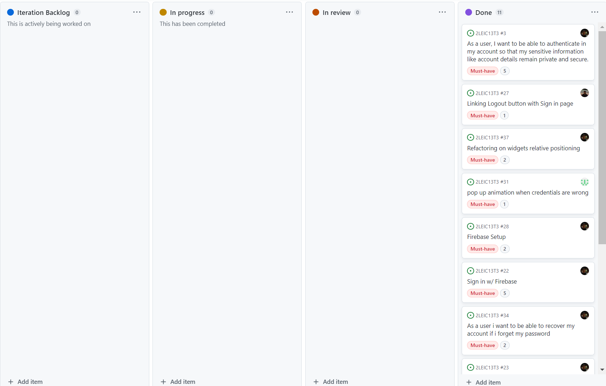

hello!

<h3> Sprint 0 </h3>

<h5> Retro </h5>

1. The design of the architure went almost perfectly. On the other hand, the user stories and acceptance tests also went pretty nicely.
2. Some mockups were missing. Also, we forgot to upload the Product Vision. 
3. We have developed our task delegation skills.
4. I feel there's nothing that we didn't quite understand.

<h3> Sprint 1</h3>

<h5> Board at sprint's beggining </h5>

<h5> Board at the end of sprint </h5>

<h5> Retro </h5>

1. This sprint went really well. We finished all the tasks way earlier, due to an efficient task selection and assignment.
2. Initially, we allocated more than we could handle for the sprint. After discussing with the professor, we realized that this wasn't a good approach and quickly redefined it.
3. It has been a really good way to learn about how the project flow is in real life. There is a lot of stuff that happens in a project, from Mockups to Project Board to Acceptance Tests, that we weren't aware about.
4. We feel like there is nothing that we didn't understand but we are sure that, throughout the next sprints, we will consolidate our understanding of Project Management even more.

<h3> Sprint 2</h3>

<h5> Board at sprint's beggining </h5>

<h5> Board at sprint's end </h5>

<h5> Retro </h5>

1. This sprint was very productive. We managed to complete all the user stories assigned for these 3 weeks.
2. We weren't able to include Unit Testing in our App this sprint.
3. We learned how to design, in a more intuitive way, the changelog. Also, we were able to learn how to connect APIs to flutter and also databases from Firebase.
4. All our questions were clearly explained by the professor.

<h3> Sprint 2</h3>

<h5> Board at sprint's beggining </h5>

<h5> Board at sprint's end </h5>

