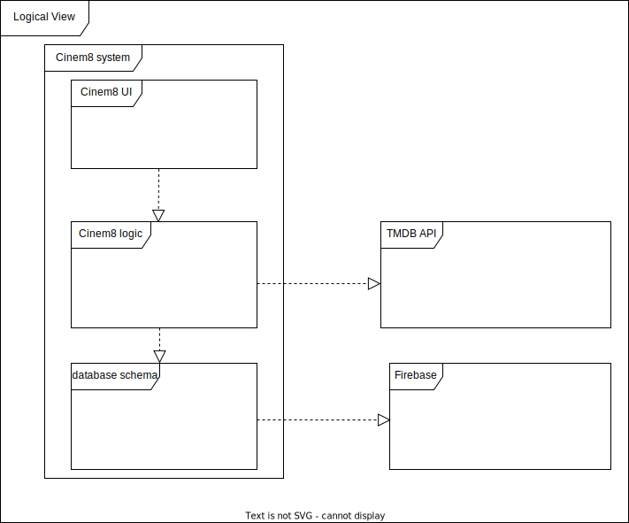

# Cinem8

The most revolutionary cinema-related app.

## Getting Started

This project is a starting point for a Flutter application.

A few resources to get you started if this is your first Flutter project:

- [Lab: Write your first Flutter app](https://docs.flutter.dev/get-started/codelab)
- [Cookbook: Useful Flutter samples](https://docs.flutter.dev/cookbook)

For help getting started with Flutter development, view the
[online documentation](https://docs.flutter.dev/), which offers tutorials,
samples, guidance on mobile development, and a full API reference.

## Domain Model
 
This model contains the following classes:

    
  * User - This class represents the user of the app. A user must have a login on the app and can acess a lot of movies.
  
  * Media - This class represents the media that can be either a movie or a series. All the information regarding each one will be acessed through the api.

  * Review - This class represents a review where a user can give his opinion about the movie and give a rating for the movie. A user can have multiple reviews for all   movies
## Physical Architecture

 

Cinem8 app physical architecture follows a simple path. First the smartphone containing the application running it in dart code. There are a lot of users in the app, so we must save and get the details of each user storing the data in one database common to everybody. All the data exterior to the user informatios is stored in API server(IMDb).

## Logical Architecture

The cinem8 app is divided into two main packages, the external devices packages, and Cinem8 system packages. Inside of the external devices packages , there are the
IMDb API package and Firebase package which represents the database content. Both this packages are core packages for the cinem8 logic package, which depends on the external device packages. Cinem8 packages contains a Cinem8 UI package that contains everything related to non-graphical and graphical user interfaces. This package implements the logic of Cinem8 logic package,

